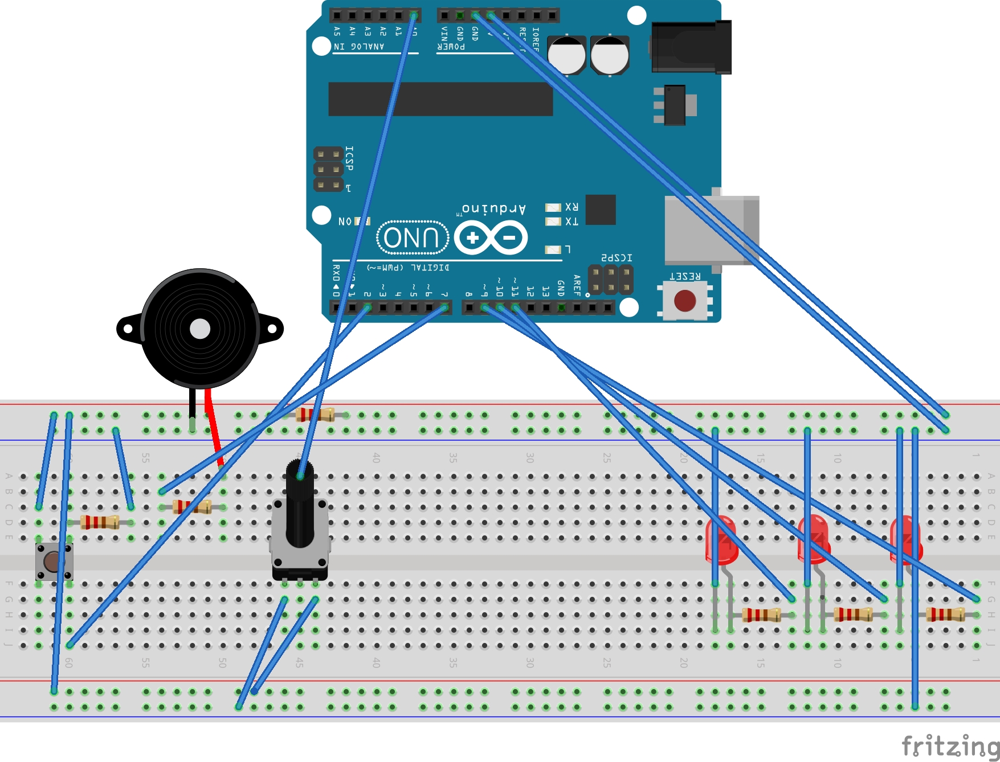

# DigitalMediaFinal
## This project is an interactive endless runner game, similar to the hit game Dino Run. The goal is to jump over the obstacles and survive as long as possible. This project incorporates custom physical controls via an Arduino device. 

## Controls:
   * **Jump:** Press the physical button connected to the Arduino OR use Spacebar on your keyboard.
   * **Lives:** You start with 3 lives. Colliding with an obstacle will cost you a life.
   * **Scoring:** Your score will increase the longer you survive. 
   * **Game Over:** The game ends when you run out of lives. Try to beat your high score.

## Techonologies used:
   * **P5.js:** Used for the games core logic, graphics and animation.
   * **Arduino Uno Rev3:** Microcontroller board for the physical interactions.

## Components:
   * sketch.js: The main branch of the game. It handles:
     * Game Setup
     * Scoring and Lives
     * Key Input
     * Serial Communication with the Arduino.
   * dinosaur.js: The playable character:
     * Player properties (position, velocity, gravity)
     * Collision detection logic
   * obstacle.js: This handles:
     * Obstacle properties
     * Movement logic
     * Displaying the obstacles
### Hardware (Arduino Setup)

The Arduino is setup up to provide more interactivity to the game:
  * **Jump button:** A physical pushbutton that allows the player to make the character jump
   * LEDs(3): Three red LEDs to represent the players remaining lives. When a life is lost in game, an LED will turn off
   * Buzzer: A passive buzzer for physical audio feedback. When you launch the game and end the game, you are greeted with audio feedback, as well with losing a life.
   * Potentiometer: This allows for controlling the volume of the game.

**Arduino Schematic for Visualization:**

**Video of Project**

      
      
    
